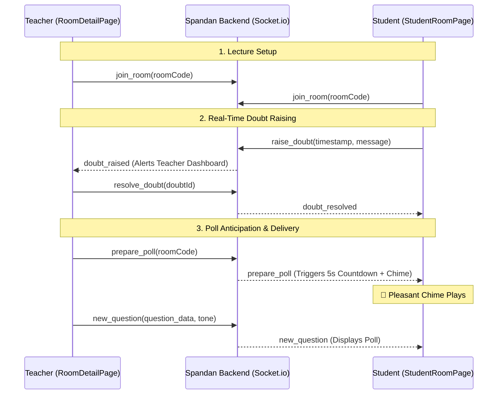

# Spandan Context & Architecture 🚀

This document outlines the core architecture and feature extensions implemented in the **Spandan Classroom Engagement System**. It provides a clear, high-level overview of how the system operates and details the specific psychological and UI/UX features integrated into the platform.

---

## 🏗️ Core Architecture Flow

Spandan operates on a real-time WebSocket architecture connecting the Teacher and Student clients through a centralized Node.js/Express server. 

---

## ✨ Intern Implementation Contributions

The following major features were implemented to enhance the psychological engagement and frictionless communication within the classroom.

### 1. 🎭 AI Question Tone & Mood Selector
**Problem:** Auto-generated questions can feel robotic and monotonous, leading to student disengagement.
**Solution:**
- Integrated a `tone` parameter into the AI Prompt Engine (`services/questionService.js`).
- Teachers can now dynamically select the mood of the questions (e.g., *Casual, Sarcastic, Technical, Humorous*).
- **Impact:** Keeps the classroom atmosphere light and matches the teacher's current teaching style, significantly boosting attention retention.

### 2. 🎵 Anticipation Countdown & Chime (Sync Protocol)
**Problem:** Dropping a poll instantly onto student screens causes anxiety and jarring context-switching.
**Solution:**
- Built a 5-second synchronized delay between the Teacher approving a question and the question appearing.
- Implemented a Web Audio API synthesizer that plays a pleasant, calming C-major chord progression (inspired by classical Raagas).
- **Impact:** Conditions the students positively. The chime acts as a gentle auditory cue to transition their focus from listening to answering, entirely removing the "pop-quiz panic."

### 3. 🙋‍♂️ Real-Time Doubt Raising System
**Problem:** In large virtual or hybrid classrooms, shy students hesitate to interrupt the teacher's flow to ask questions.
**Solution:**
- Deployed a persistent floating **Raise Doubt** button on the student client.
- Students can flag a doubt at an exact timestamp with an optional note.
- The Teacher Dashboard receives a real-time notification badge and populates a sliding chronological Doubts Panel.
- **Impact:** Allows frictionless communication. Teachers can review doubts without breaking their lecture flow and mark them as resolved when addressed.

---

## 🛠️ Technical Stack
- **Frontend:** React, Vite, Socket.io-client
- **Backend:** Node.js, Express, Socket.io
- **AI Engine:** MiniMax / Gemini (via API)
- **Audio:** Native Browser Web Audio API (Zero external assets)
